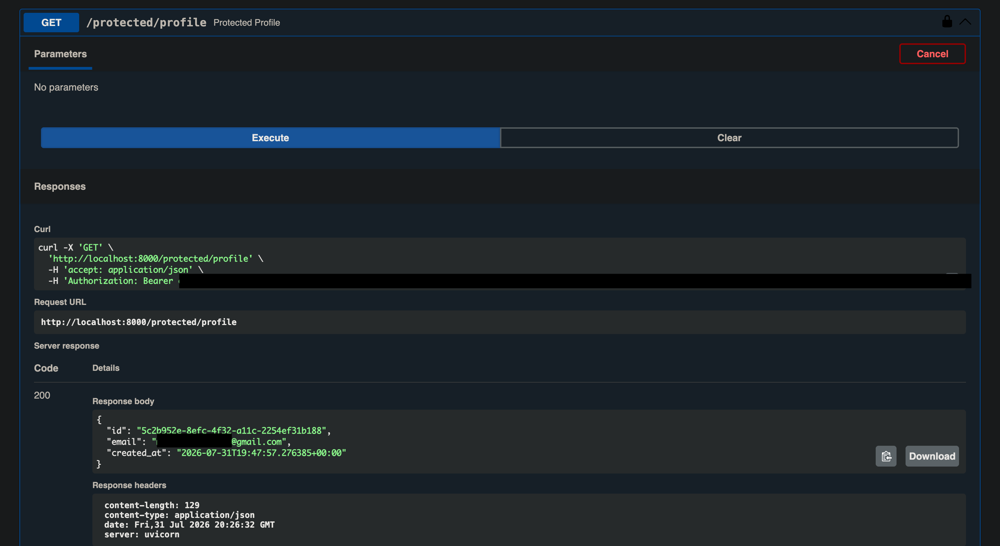
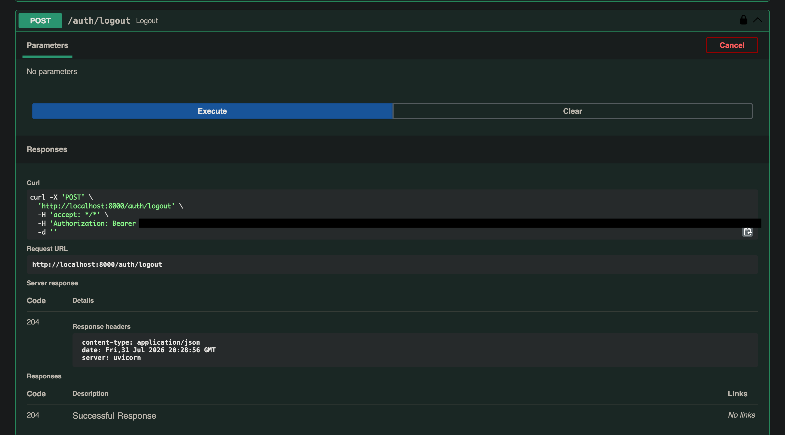

# Auth Practice API

A secure authentication API built with FastAPI, using Supabase Auth as the identity provider. It handles user sign up, log in, and log out, and protects specific routes so they only respond to requests carrying a valid, verified JWT.

No password hashing or token signing happens in this codebase — Supabase Auth owns that responsibility entirely. This API's job is narrower and more deliberate: receive a token, verify it against Supabase on every request, and let a request through only if that verification succeeds.

## How it works

- **Sign up / Log in** call Supabase Auth directly (`sign_up`, `sign_in_with_password`), which returns a JWT access token and refresh token on success.
- **Protected routes** require an `Authorization: Bearer <token>` header. A reusable FastAPI dependency extracts the token and calls `supabase.auth.get_user(token)` — a real network call to Supabase's Auth server — before the route body ever runs. An expired, tampered, or missing token is rejected with `401` before any route logic executes.
- **Log out** is itself a protected route: you must present a valid token to end the session.

## Setup

**1. Clone the repo**

```bash
git clone <your-repo-url>
cd auth-api
```

**2. Create a virtual environment and install dependencies**

```bash
python3 -m venv venv
source venv/bin/activate      # venv\Scripts\activate on Windows
pip install -r requirements.txt
```

**3. Set up environment variables**

Copy the example file and fill in your own Supabase project values:

```bash
cp .env.example .env
```

```
SUPABASE_URL=your_project_url
SUPABASE_KEY=your_anon_key
PORT=8000
```

Find these under your Supabase project's **Settings → API**. Use the **anon** key only — never the `service_role` key, which bypasses all access restrictions and should never live in an application like this one.

**4. Disable email confirmation for local testing (optional, recommended)**

By default, Supabase requires users to confirm their email before logging in. For local testing, this project's dashboard did not expose the usual toggle for this, so it was disabled by running the following directly in the Supabase SQL Editor:

```sql
update auth.users
set email_confirmed_at = now()
where email_confirmed_at is null;
```

Re-run this after each new test signup if confirmation continues to block login. In a real production project, this would remain enabled.

**5. Run the server**

```bash
uvicorn main:app --reload --port 8000
```

The API is now running at `http://localhost:8000`, with interactive Swagger docs at `http://localhost:8000/docs`.

## API Reference

| Method | Endpoint              | Auth required | Description                                      |
|--------|------------------------|:--------------:|---------------------------------------------------|
| POST   | `/auth/signup`         | No             | Register a new user via Supabase Auth             |
| POST   | `/auth/login`          | No             | Log in and receive an access token + refresh token |
| POST   | `/auth/logout`         | Yes            | End the current session                           |
| GET    | `/public/info`         | No             | Open endpoint, returns a public message            |
| GET    | `/protected/profile`   | Yes            | Returns the authenticated user's id, email, and creation date |
| GET    | `/protected/dashboard` | Yes            | Second protected route, demonstrating the auth guard is reusable |

Protected routes expect a header of the form:

```
Authorization: Bearer <access_token>
```

A missing or malformed header returns `401` with `{"detail": "Access token required"}`. An expired or invalid token returns `401` with `{"detail": "Invalid or expired token"}`.

## Swagger UI

Interactive docs are available at `/docs`. Protected routes are marked with a lock icon — click **Authorize**, paste an access token obtained from `/auth/login`, and use **Try it out** on any route without needing curl.




## Tech stack

- FastAPI
- Supabase Auth (Python SDK)
- Uvicorn
- Pydantic